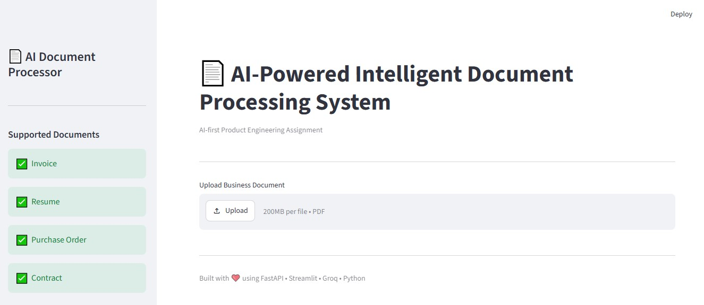
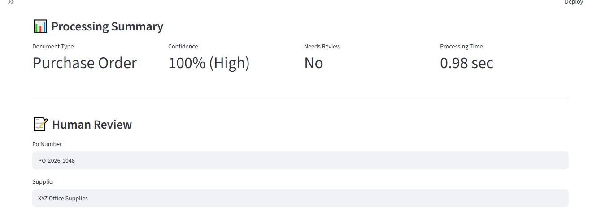
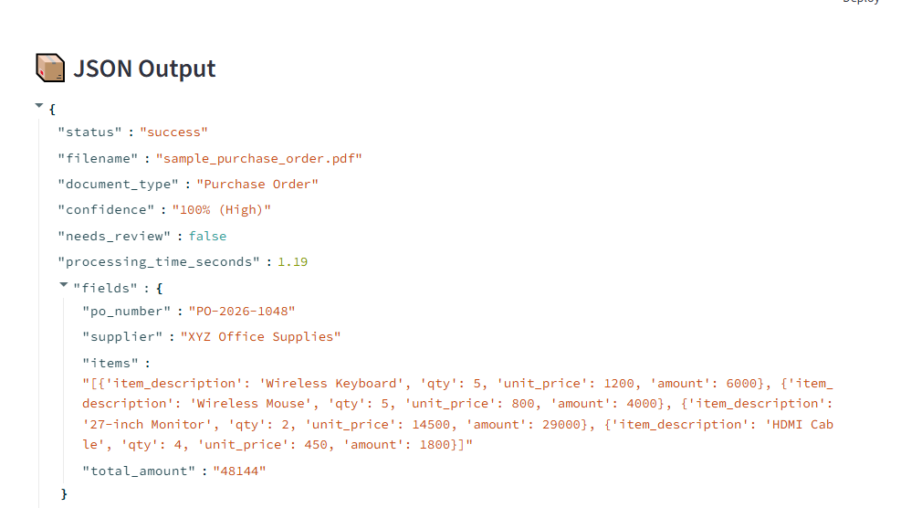

# 📄 AI-Powered Intelligent Document Processing System

An AI-powered document processing application that automatically classifies business documents, extracts structured information using an LLM, validates the extracted data, and allows users to review and download the results.

---

# 🚀 Features

- Automatic document classification
- AI-based information extraction
- Rule-based validation
- Human review interface
- JSON output
- REST API using FastAPI
- Interactive UI using Streamlit

---

# 📂 Supported Document Types

- Invoice
- Resume
- Purchase Order
- Contract

---

# 🏗 Architecture

```
                Upload Document
                       │
                       ▼
              Document Reader
                       │
                       ▼
             AI Document Classifier
                       │
                       ▼
          AI Information Extractor
                       │
                       ▼
         Deterministic Validator
                       │
                       ▼
           Human Review (UI)
                       │
                       ▼
               JSON / API Output
```

---

# 🤖 AI Components

The Large Language Model is responsible for:

- Document Classification
- Information Extraction
- Understanding different document layouts
- Extracting structured JSON

---

# ✔ Deterministic Components

Python validation is used for:

- Email validation
- Phone validation
- GST validation
- Amount validation
- Date validation

Using deterministic logic for validation makes the system faster, cheaper and more reliable than sending another request to the LLM.

---

# 🛠 Tech Stack

## Backend

- Python
- FastAPI
- Groq API
- pdfplumber

## Frontend

- Streamlit

## AI Model

- Llama 3.3 70B Versatile (Groq)

---

# 📁 Project Structure

```
AI-Document-Processor/

│

├── Backend/

│   ├── ai_client.py

│   ├── classifier.py

│   ├── extractor.py

│   ├── validator.py

│   ├── document_reader.py

│   ├── document_processor.py

│   ├── app.py

│

├── Frontend/

│   └── streamlit_app.py

│

├── Sample_Documents/

│

├── requirements.txt

│

└── README.md
```

---

# 📸 Application Screenshots

---

## 🏠 Home Page

The main dashboard where users can upload business documents for processing.

<p align="center">
  
</p>

---

## 📊 Processing Summary

Displays the AI-generated document type, confidence score, review status, and processing time.

<p align="center">
  
</p>

---

## 📦 Structured JSON Output

Shows the extracted structured JSON and allows downloading the corrected result.

<p align="center">
  
</p>

---

## 🚀 FastAPI Swagger Documentation

Interactive API documentation generated by FastAPI.

<p align="center">
  
</p>


# ▶ How to Run

## Clone repository

```bash
git clone <repository_url>
```

---

## Install dependencies

```bash
pip install -r requirements.txt
```

---

## Configure Environment

Create a `.env` file.

```
GROQ_API_KEY=YOUR_API_KEY
```

---

## Start Backend

```bash
cd Backend

uvicorn app:app --reload
```

---

## Start Frontend

```bash
cd Frontend

streamlit run streamlit_app.py
```

---

# 📤 API Endpoint

POST

```
/process-document
```

Returns

```json
{
    "status": "success",
    "document_type": "...",
    "confidence": "...",
    "fields": {},
    "validation": {}
}
```

---

# 📈 Design Decisions

### Why AI?

AI is used where semantic understanding is required:

- Document classification
- Information extraction

Traditional rule-based approaches struggle with varying document layouts, whereas an LLM can generalize across formats.

---

### Why Deterministic Validation?

Validation is implemented using Python rather than AI because:

- Faster execution
- Lower cost
- More predictable
- Easier to maintain

---

### Extensibility

The architecture separates:

- Reading documents
- Classification
- Extraction
- Validation
- API
- User Interface

Adding a new document type only requires:

- A new extraction prompt
- New validation rules (if applicable)

No other components need modification.

---

# ⚠ Assumptions

- Primary input format is machine-readable PDF.
- Documents contain sufficient text for AI extraction.
- Users manually review extracted information before download.

---

# 🚀 Future Improvements

- OCR support for scanned PDFs
- Image (JPG/PNG) processing
- Confidence scoring per field
- Batch document processing
- Database integration
- User authentication
- Export to Excel
- Human feedback loop for AI improvement


# 👨‍💻 Author

Premjith P M
